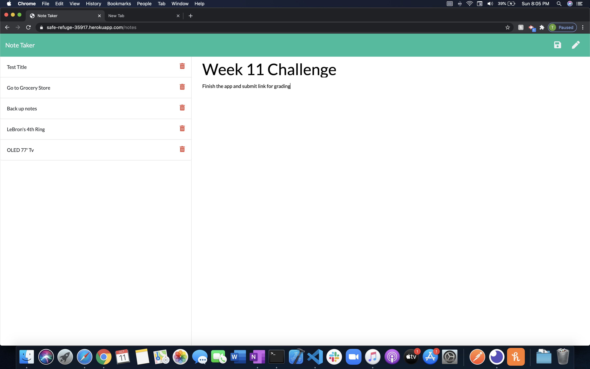

# week-11-challenge
Express.js: Note Taker

- https://safe-refuge-35917.herokuapp.com/

## Description
A Note Taker app that allows you to keep track of vitale notes in a easy to view manner.  You can easily add notes throughout the day and easily delete those you've already completed.
***
## Table of Contents
[Installation](#installation) 
[Usage](#usage) 
[Credits](#credits) 
[Tests](#tests) 
[License](#license) 
[Questions](#questions) 
***
## Installation
npm install

## Usage
Able to add and delete notes

## Credits
None at this moment

## Demo

## Tests
none

## Questions :question:
For further questions on this project or future collaboration contact me at: 
* GitHub: terahje
* Email: terahjequinn@gmail.com
* Repository link: https://github.com/terahje/week-11-challenge

## License
### This license is covered under the following license(s):
* Click MIT_License for more information.
***

## Footer
* Created by: terahje :copyright: 2020
